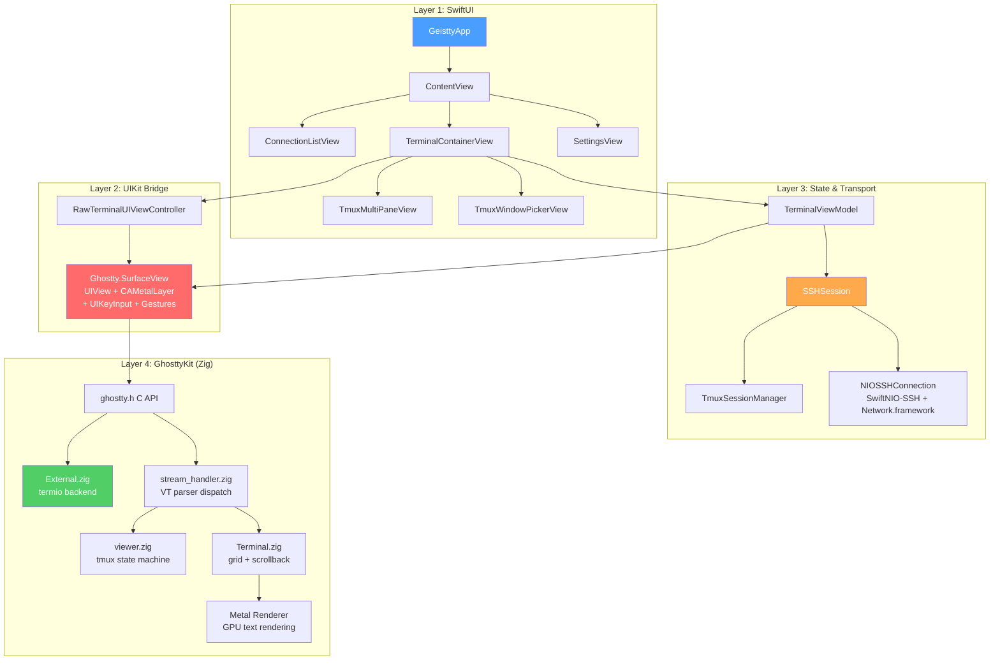
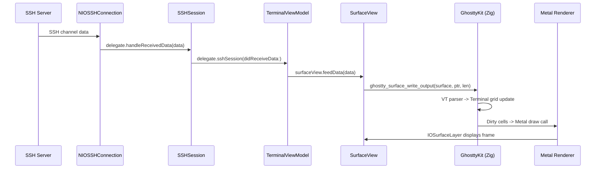
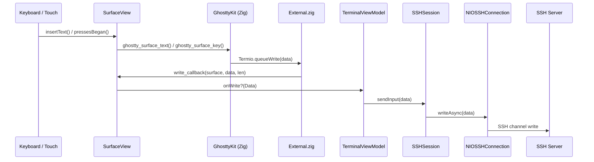
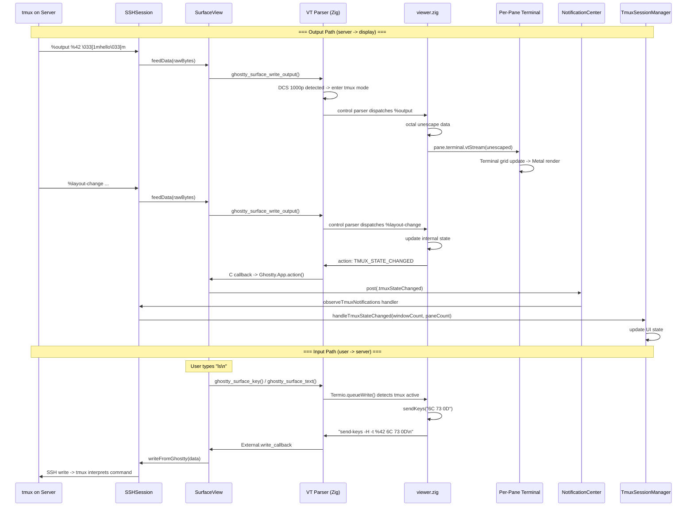
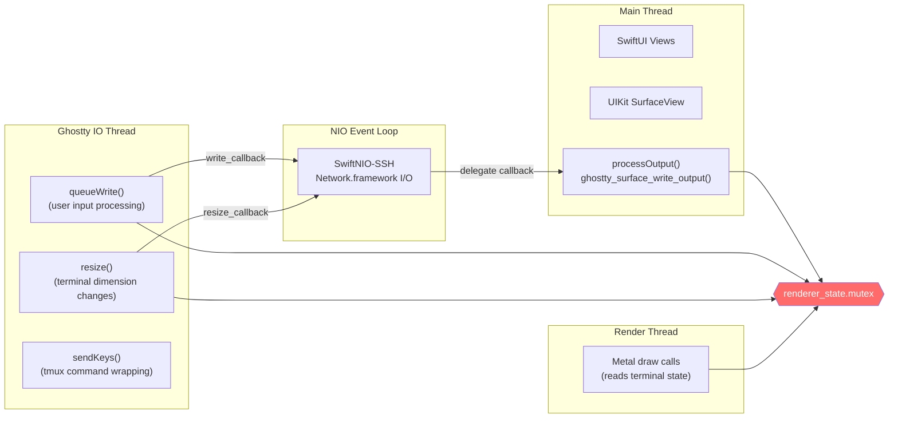
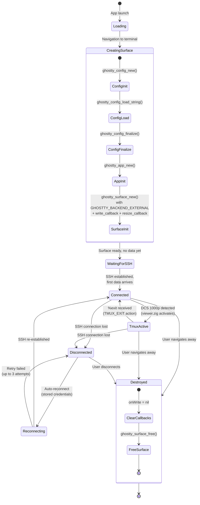
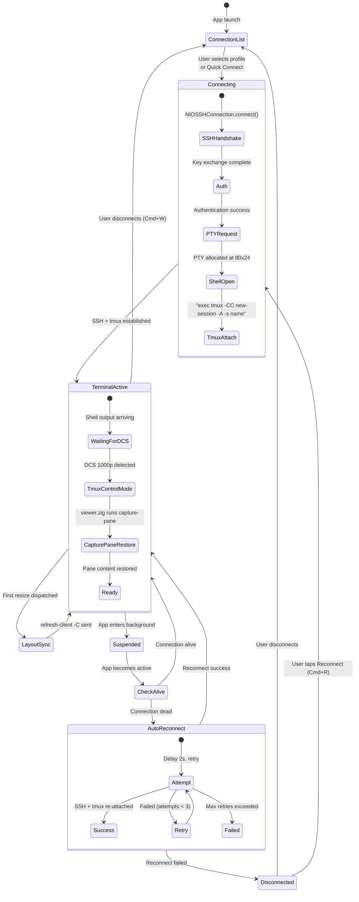
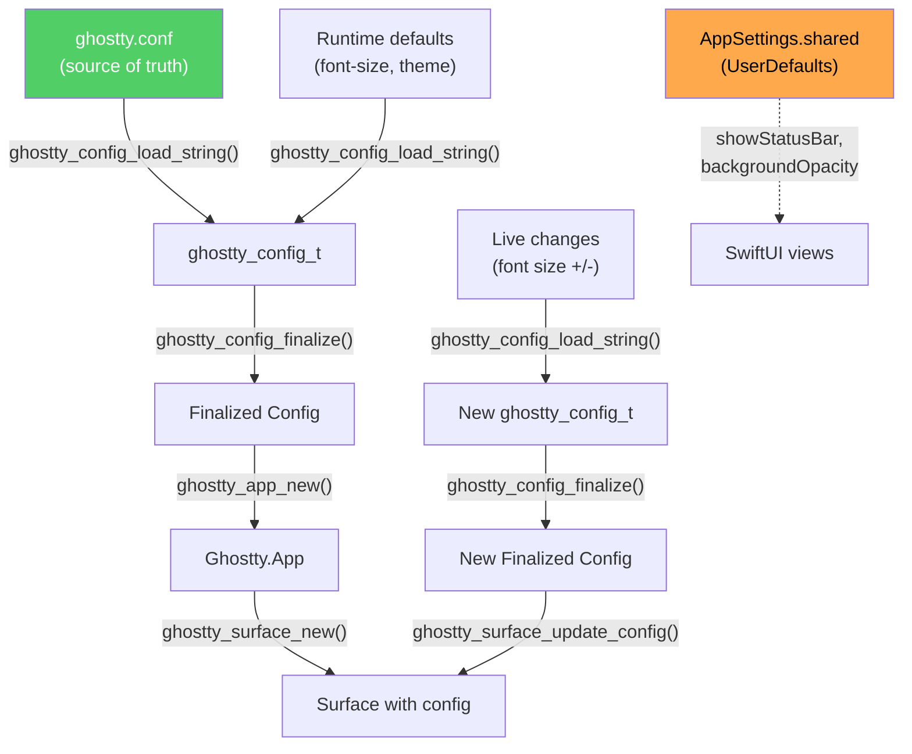
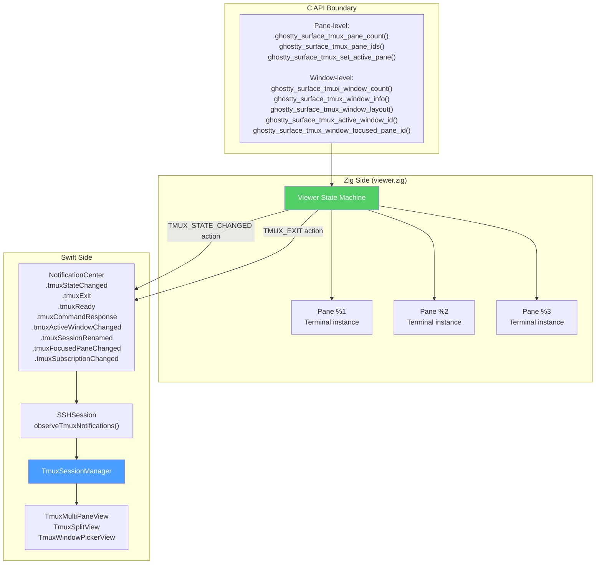

# Architecture

> Geistty v0.3 -- March 2026

Geistty is a native iOS/iPadOS SSH terminal that uses [Ghostty](https://ghostty.org)'s real terminal engine (compiled from Zig) with an External termio backend. iOS cannot spawn local shells (no `fork`/`exec`/PTY), so all terminal data flows over SSH. Ghostty handles VT parsing, Metal rendering, and tmux control mode. Swift handles SSH transport, connection management, and iOS UI.

This document describes how the pieces fit together.

---

## Table of Contents

- [Layer Diagram](#layer-diagram)
- [File Inventory](#file-inventory)
- [The Big Four](#the-big-four)
- [Data Flow: Output Path](#data-flow-output-path)
- [Data Flow: Input Path](#data-flow-input-path)
- [Data Flow: tmux Control Mode](#data-flow-tmux-control-mode)
- [Threading Model](#threading-model)
- [Surface Lifecycle](#surface-lifecycle)
- [Connection Lifecycle](#connection-lifecycle)
- [Config System](#config-system)
- [tmux State Management](#tmux-state-management)
- [Ghostty Fork: What We Changed](#ghostty-fork-what-we-changed)
- [Gap Analysis: What Would Mitchell Do?](#gap-analysis-what-would-mitchell-do)
- [Known Issues and Technical Debt](#known-issues-and-technical-debt)

---

## Layer Diagram

Geistty is an onion. Four layers, outside-in:



**Layer 1 (SwiftUI)** owns navigation, connection profiles, settings, and tmux pane layout views. It never touches Ghostty directly.

**Layer 2 (UIKit)** is where Metal rendering lives. `SurfaceView` is a `UIView` subclass that hosts an `IOSurfaceLayer` for GPU rendering and implements `UIKeyInput` for keyboard capture. This layer exists because Ghostty's renderer needs a real `CALayer`, not a SwiftUI view.

**Layer 3 (State & Transport)** manages SSH connections, terminal state, and tmux session tracking. `TerminalViewModel` coordinates between the SSH session and the surface view. `SSHSession` owns the network connection and delegates data to the view model.

**Layer 4 (GhosttyKit)** is Ghostty's Zig core compiled as a static library. It handles VT parsing, terminal grid state, Metal rendering, and (in our fork) the External termio backend and tmux control mode viewer.

---

## File Inventory

49 Swift source files across 6 directories:

| Directory | Files | Purpose |
|-----------|-------|---------|
| `App/` | `GeisttyApp.swift`, `ContentView.swift` | Entry point, root navigation, `AppState` |
| `Auth/` | `ConnectionProfile.swift`, `CredentialProvider.swift`, `KeychainManager.swift`, `SSHKeyManager.swift`, `SSHKeyParser.swift`, `BiometricGatekeeper.swift` | SSH credentials, Keychain, key generation/parsing, biometric auth |
| `Ghostty/` | `Ghostty.swift`, `Ghostty.App.swift`, `Ghostty.Config.swift`, `Ghostty.Command.swift`, `Ghostty.SearchState.swift`, `Ghostty.SurfaceConfiguration.swift`, `GhosttyInput.swift`, `FontMapping.swift`, `ConfigSyncManager.swift`, `SurfaceSearchOverlay.swift`, `SelectionOverlay.swift`, `TmuxSurfaceProtocol.swift` | C API bridge, keyboard input, config, search UI, selection overlay, tmux protocol abstraction |
| `SSH/` | `NIOSSHConnection.swift`, `SSHSession.swift`, `SSHCommandRunner.swift`, `TmuxSessionManager.swift`, `TmuxLayout.swift`, `TmuxSplitTree.swift`, `TmuxModels.swift`, `TmuxSessionNameResolver.swift`, `TmuxWireDiagnostics.swift` | SSH transport, command execution, tmux state management, wire diagnostics |
| `Terminal/` | `RawTerminalUIViewController+Keyboard.swift`, `+MenuBar.swift`, `+Search.swift`, `+Shortcuts.swift`, `+StatusBar.swift`, `+Tmux.swift`, `+WindowPicker.swift`, `TerminalContainerView.swift`, `TerminalToolbar.swift`, `TmuxMultiPaneView.swift`, `TmuxSplitView.swift`, `TmuxWindowPickerView.swift`, `TmuxSessionPickerView.swift`, `TmuxStatusBarView.swift`, `CommandPaletteView.swift`, `Theme.swift` | Terminal UI, VC extensions, multi-pane layouts, status bar, command palette, theming |
| `UI/` | `ConnectionListView.swift`, `ConnectionEditorView.swift`, `SettingsView.swift`, `KeyTableIndicatorView.swift` | Connection management UI, settings |

---

## The Big Four

Four files carry most of the weight. Everything else is supporting cast.

### 1. `Ghostty.swift` (~2837 lines)

SurfaceView — the UIView subclass that hosts Ghostty's Metal rendering. Handles:

- Surface creation/destruction via C API
- Metal layer hosting (IOSurfaceLayer as sublayer)
- `UIKeyInput` for software keyboard
- `pressesBegan`/`pressesEnded` for hardware keyboard
- Gesture recognizers (scroll, selection, pinch-zoom)
- Write callback (user input -> SSH)
- Resize callback (terminal dimensions -> SSH/tmux)
- Search overlay coordination
- tmux C API wrappers (pane and window queries via `TmuxSurfaceProtocol`)
- Notification posting for tmux actions
- Multi-pane observer surface management (attach/detach, gesture contract)

Note: `Ghostty.App`, `Ghostty.Config`, `SearchState`, and `SurfaceConfiguration` were extracted into separate files (E1-E4 decomposition, Session 25) following upstream naming conventions.

### 2. `SSHSession.swift` (~1749 lines)

SSH connection lifecycle, tmux control mode entry, reconnection logic, and data routing. Key responsibilities:

- Connect/disconnect/reconnect with credential storage
- `handleReceivedData()` -- routes SSH bytes to the surface view
- tmux notification observation (state changes, exits)
- Forwards tmux events to `TmuxSessionManager`
- Manages `isReconnecting` state and retry logic

### 3. `TerminalContainerView.swift` (~1145 lines)

SwiftUI view + UIKit view controller bridge. The view controller (`RawTerminalUIViewController`) creates and owns the `SurfaceView`. The VC was decomposed into focused extensions:

- `+Keyboard.swift` — keyboard show/hide, accessory bar
- `+MenuBar.swift` — iPadOS menu bar integration
- `+Search.swift` — search overlay coordination
- `+Shortcuts.swift` — keyboard shortcut dispatch
- `+Tmux.swift` — tmux state observation, split management
- `+WindowPicker.swift` — tmux window tab bar

The SwiftUI wrapper handles toolbar, multi-pane vs single-pane transitions, and disconnect overlay.

### 4. `TmuxSessionManager.swift` (~2062 lines)

Tracks tmux windows, panes, and sessions. Manages the mapping between tmux pane IDs and Ghostty surfaces. Handles:

- `handleTmuxStateChanged()` from Ghostty notifications
- Window/pane creation and destruction
- Split tree construction from layout strings
- Active pane switching
- Resize debouncing

---

## Data Flow: Output Path

SSH server output to terminal display (non-tmux mode):



In non-tmux mode, the path is straight: bytes arrive over SSH, get fed to Ghostty, Ghostty parses escape sequences, updates the terminal grid, and Metal renders the result. No tmux wrapping, no `%output` parsing.

---

## Data Flow: Input Path

User keystrokes to SSH server (non-tmux mode):



The write callback is the key mechanism: when the Zig side wants to send bytes (the terminal's response to user input), it calls back into Swift through a C function pointer. `SurfaceView` holds this as `onWrite`, which the view model connects to the SSH session.

---

## Data Flow: tmux Control Mode

This is where it gets interesting. In tmux control mode (`tmux -CC`), Ghostty's Zig code handles the entire protocol:



Key insight: **all stdin in tmux control mode is interpreted as tmux commands**. User keystrokes are hex-encoded and wrapped in `send-keys -H -t %<paneID>` by Ghostty's Zig code. The Swift side is a pure pass-through -- it never sees or wraps tmux commands.

### tmux protocol detail

tmux control mode uses `%`-prefixed messages. Ghostty's `control.zig` parser handles:

| Message | Format | Handling |
|---------|--------|----------|
| `%output` | `%output %<paneID> <octal-escaped-data>` | Routed to per-pane Terminal via `viewer.receivedOutput()` |
| `%begin` | `%begin <time> <num> <flags>` | Command response start (handled by viewer) |
| `%end` | `%end <time> <num> <flags>` | Command response end |
| `%error` | `%error <time> <num> <flags>` | Command error |
| `%layout-change` | `%layout-change <window> <layout>` | Triggers `TMUX_STATE_CHANGED` action to Swift |
| `%session-changed` | `%session-changed $<id> <name>` | Session switch |
| `%exit` | `%exit [reason]` | Control mode exited, triggers `TMUX_EXIT` action |

Data in `%output` uses octal escaping: bytes < 32 and `\` are encoded as `\NNN` (e.g., `\033` for ESC). Ghostty's viewer unescapes this before feeding it to the per-pane terminal.

---

## Threading Model



The `renderer_state.mutex` is the critical synchronization point. It protects the terminal grid state that all threads access:

| Thread | Operations | Holds Mutex? |
|--------|-----------|--------------|
| **Main** | `ghostty_surface_write_output()` -- feeds SSH data to VT parser | Yes |
| **IO** | `queueWrite()` -- processes user input, `sendKeys()` wraps for tmux | Yes |
| **IO** | `resize()` -- updates terminal dimensions, sends `refresh-client -C` | Yes |
| **Render** | Reads terminal cells for Metal draw calls | Yes |
| **NIO** | SSH network I/O (independent, no mutex) | No |

The IO thread and render thread are created by Ghostty internally. The NIO event loop is managed by SwiftNIO with `NIOTSEventLoopGroup` (backed by Network.framework for iOS power management).

---

## Surface Lifecycle



**iOS-specific considerations:**

1. **IOSurfaceLayer as sublayer**: On iOS, Ghostty adds its Metal rendering surface as a sublayer (macOS replaces the layer entirely). We manually resize sublayers in `sizeDidChange()`.

2. **`addSublayer` selector mismatch**: Ghostty's Zig ObjC bridge calls `objc.sel("addSublayer")` without the colon. We register a runtime method on `SurfaceView` to handle this.

3. **Surface cleanup**: macOS Ghostty uses `Task.detached { @MainActor in ghostty_surface_free() }` in deinit. We do a direct `close()` call. This is a known gap -- see [Gap Analysis](#gap-analysis-what-would-mitchell-do).

---

## Connection Lifecycle



**Credential handling for reconnect:**

- Stored in memory on successful connect (`storedPassword`, `storedProfile`, `storedCredential`)
- Cleared on explicit disconnect (prevents unwanted reconnect)
- Never persisted to disk (Keychain stores saved profiles separately)

---

## Config System

Ghostty configuration flows from `ghostty.conf` through the C API:



**Current state:** `ghostty.conf` is the primary config source for terminal behavior (font, theme, colors, scrollback). However, a few UI preferences live in `AppSettings.shared` (UserDefaults): `showStatusBar`, `backgroundOpacity`. This split is a known gap -- see [Gap Analysis](#gap-analysis-what-would-mitchell-do).

**Config classes:**

- `Ghostty.Config` -- wraps `ghostty_config_t`, handles load/finalize lifecycle
- `ConfigSyncManager` -- watches `ghostty.conf` for changes, triggers reload
- `AppSettings` -- singleton for UserDefaults-based UI prefs

---

## tmux State Management



**Lazy/pull state architecture:** The Zig viewer owns the authoritative tmux state (pane terminals, active pane, layout). The Swift `TmuxSessionManager` tracks a shadow of this state for UI purposes. When the viewer fires `TMUX_STATE_CHANGED`, Swift queries the window-level C API to sync window info, layout strings, and focused panes. This lazy/pull pattern — where the core owns state and the apprt queries it on notification — is native to Ghostty's architecture. See [ADR-005](docs/decisions/ADR-005-lazy-pull-tmux-architecture.md) for the full rationale.

**Layout pipeline:** When `TMUX_STATE_CHANGED` fires, `handleTmuxStateChanged()` queries `ghostty_surface_tmux_window_layout()` for each window's layout string, then parses it with `TmuxLayout.swift` to build `TmuxSplitTree` structures for the SwiftUI multi-pane rendering. The focused pane per window is queried via `ghostty_surface_tmux_window_focused_pane_id()` and used as the preferred initial focus when switching windows.

---

## Multi-Pane Surface Architecture

When tmux has multiple panes, Geistty creates one primary surface and N-1 observer surfaces. This architecture took 38 sessions (68-106) to build.

### Surface Roles

| Surface | Type | Creation | Keyboard Input | `canBecomeFirstResponder` |
|---------|------|----------|---------------|---------------------------|
| Primary | Adopted from direct surface | Created at SSH connect time | Always firstResponder | `true` |
| Observer | Factory-created per extra pane | Created in `getSurfaceOrCreate()` | Routed via `selectPane()` | `false` |

The primary surface renders the lowest-numbered pane. Observer surfaces render all other panes.

### The Two `setActiveTmuxPane` Variants

A critical architectural distinction — two separate C APIs for setting the active pane:

| API | Sets `active_pane_id`? | Swaps `renderer_state.terminal`? | Registers observer? | Used by |
|-----|----------------------|--------------------------------|--------------------|---------| 
| `ghostty_surface_tmux_set_active_pane` | Yes | Yes | Yes | `activateFirstTmuxPane`, `selectWindow` |
| `ghostty_surface_tmux_set_active_pane_input_only` | Yes | No | No | `selectPane`, `setFocusedPane`, `handleTmuxStateChanged` |

**Why two?** `setActiveTmuxPane` (full) swaps BOTH input routing AND the renderer — it was designed for single-surface mode where one surface renders everything. In multi-pane mode, each surface has its own renderer pointed at its own pane's terminal. `setActiveTmuxPaneInputOnly` changes which pane receives keystrokes without disturbing any surface's renderer binding.

### Observer Registration (Renderer Bleed Fix)

`stream_handler.zig:syncLayouts()` re-points the primary renderer at `active_pane_id`. In multi-pane mode, `active_pane_id` tracks input routing (which may differ from the primary's rendered pane). The fix: `ghostty_surface_tmux_set_active_pane` registers the primary surface as an observer so that `fixupObservers()` corrects the renderer after `syncLayouts()`.

```
ghostty_surface_tmux_set_active_pane:
  1. viewer.unregisterObserverByPtr(&surface.renderer_state.terminal)
  2. Set renderer_state.terminal = &pane.terminal
  3. viewer.registerObserver(pane_id, &surface.renderer_state.terminal, ...)
  4. Set active_pane_id = pane_id

After syncLayouts → fixupObservers():
  For each observer, re-points terminal_ptr at the correct pane's terminal
```

### Observer Gesture Contract

After `attachToTmuxPane()`, observer surfaces have exactly 3 gestures:

1. `UITapGestureRecognizer` (1 tap, 1 touch) — pane switching via `handleTap()` → `onPaneTap()`
2. `UIPinchGestureRecognizer` — per-pane font size via `handlePinch()`
3. `UITapGestureRecognizer` (2 taps, 2 touches) — font reset via `handleTwoFingerDoubleTap()`

Primary surfaces retain the full gesture suite (12+ gestures). Font size is per-surface in Ghostty — each Surface has independent `font_size`, `font_grid_key`, `font_metrics`.

### Focus System

Clean and minimal (post nuke-and-pave in Session 97):

- `canBecomeFirstResponder` returns `!isMultiPaneObserver` — only the primary surface can become first responder
- `selectPane(paneId)` calls `setActiveTmuxPaneInputOnly` to route keystrokes
- `handleTap()` on observer calls `onPaneTap()` callback → `selectPane()`
- `handleTap()` on primary calls `selectPane()` directly for the primary's pane
- No guards, no interceptors, no `onWrite` hooks fighting the focus system

---

## Ghostty Fork: What We Changed

Our fork (`daiimus/ghostty`, branch `ios-external-backend`) adds or modifies these files relative to upstream:

| File | Change | Purpose |
|------|--------|---------|
| `src/termio/External.zig` | **New** (~379 lines, 7 tests) | Termio backend that receives data via API, not PTY. Write/resize callbacks to Swift. |
| `src/terminal/tmux/viewer.zig` | **New** (~2700 lines, ~12 tests) | tmux control mode state machine. Per-pane terminals, capture-pane restore, sendKeys, resize. |
| `src/terminal/tmux/control.zig` | **New/Modified** | tmux control mode protocol parser with octal unescape. |
| `src/termio/stream_handler.zig` | Modified | DCS 1000p detection triggers Viewer. On exit, resets `renderer_state.terminal` before freeing (prevents use-after-free). |
| `src/termio/Termio.zig` | Modified | `queueWrite` intercepts when tmux viewer active -> `viewer.sendKeys()`. Resize sends `refresh-client -C`. |
| `src/termio/message.zig` | Modified | Added `write_*_direct` variants that bypass tmux send-keys wrapping. |
| `src/termio/backend.zig` | Modified | Added `external` variant to Kind/Config/Backend/ThreadData unions. |
| `src/config/CApi.zig` | Modified | Added `ghostty_config_load_file`, `ghostty_config_load_string`. |
| `src/terminal/dcs.zig` | Modified | `pending_esc` field for ESC in DCS passthrough without premature termination. |
| `include/ghostty.h` | Modified | Backend type, callbacks, `ghostty_surface_write_output()`, tmux pane APIs, action entries. |
| `src/apprt/embedded.zig` | Modified | Platform union with MacOS/IOS variants. `getTermioBackend()` returns exec or external. |

**Effective commit history (v0.1-stable):**

| # | Commit | Description |
|---|--------|-------------|
| 1 | `77402cb` | DCS passthrough fix -- ESC/CAN/SUB |
| 2 | `cceab0f` | Zig-side send-keys user input routing |
| 3 | `925ba95` | DCS passthrough fix #2 -- C1 control codes |
| 4 | `dca26cf` | Data race fix on tmux viewer and active_pane_id |
| 5 | `236c89a` | Command swallowing fix |
| 6 | `b54acee` | Blank screen fix after capture-pane restore |
| 7 | `1b59b70` | libxev dependency update |
| 8 | `aa6c99b` | Resize callback for External backend |
| 9 | `0a8c369` | tmux resize: data race fix, startup catch-up, pane terminal resize |
| 10 | `216ff75` | Use-after-free fix in `renderer_state.terminal` after `syncLayouts` |
| 11 | `602c662` | Persistent VT parser across `%output` messages + absorbing state reset |
| 12 | `a2ec06b` | Multi-pane terminal binding — shared mutex observer system |
| 13 | `65b19c0` | Observer wakeup callback for iOS renderer wake (no display link) |
| 14 | `985b505` | Input-only active pane API (`ghostty_surface_tmux_set_active_pane_input_only`) |
| 15 | `5b6d51e` | Observer registration for renderer bleed fix + `unregisterObserverByPtr` |

The revert pair (`b82cf2d` persistent VT stream + `204c7cd` revert) cancel each other out and are not listed above. The persistent VT parser approach was later re-implemented correctly in commit 11 with absorbing state reset.

---

## Gap Analysis: What Would Mitchell Do?

A comparison of our patterns against upstream macOS Ghostty. These are not bugs -- the app works -- but they represent deviations from the patterns Mitchell Hashimoto established.

### Critical Gaps

#### 1. No DerivedConfig Pattern

**Upstream:** macOS Ghostty extracts relevant config values into a `DerivedConfig` struct at init time. This provides type safety, avoids repeated C API calls, and makes config dependencies explicit.

**Us:** We read config values ad-hoc through the C API or construct config strings on the fly. This means config dependencies are scattered and implicit.

**Impact:** Medium. Makes it harder to reason about which config values affect which components. Also means we can't easily test config-dependent behavior.

**Fix:** Extract a `DerivedConfig` struct that captures the values we actually use (font family, font size, theme, scrollback, cursor style, etc.) and pass it through instead of the raw config handle.

#### 2. Surface Cleanup Threading

**Upstream:** macOS uses `Task.detached { @MainActor in ghostty_surface_free() }` in deinit to ensure the surface is freed on the main actor.

**Us:** We call `ghostty_surface_free()` directly in `close()` / `deinit`, which may execute on any thread.

**Impact:** Low (no crashes observed), but technically unsafe. The Metal layer and its resources should be freed on the main thread.

**Fix:** Adopt the `Task.detached { @MainActor }` pattern from upstream.

#### 3. SurfaceView Organization

**Upstream:** macOS Ghostty keeps `SurfaceView` in a single file (`Ghostty.SurfaceView_AppKit.swift`), with separate files for `+Input`, `+Gestures`, etc.

**Us:** `Ghostty.swift` is ~2837 lines with SurfaceView as the primary content. We extracted `App`, `Config`, `SearchState`, and `SurfaceConfiguration` into separate files (E1-E4), following upstream naming. We decided NOT to further split SurfaceView because upstream keeps theirs in a single file too.

**Impact:** Low. Matches upstream pattern. The VC side was decomposed into 6 extension files for the same purpose.

### Moderate Gaps

#### 4. Limited NotificationCenter Usage

**Upstream:** macOS uses extensive NotificationCenter for surface state changes: config changes, color changes, bell, readonly mode, key sequences, title changes.

**Us:** We use NotificationCenter for tmux state (`tmuxStateChanged`, `tmuxExit`) but handle other state changes through direct delegation or published properties.

**Impact:** Low. Our delegation pattern works fine for a single-surface app. If we add multi-window support, notifications would scale better.

#### 5. Config Source Split

**Upstream:** All terminal config lives in `ghostty.conf`. No UserDefaults.

**Us:** Most config is in `ghostty.conf`, but some UI preferences (`showStatusBar`, `backgroundOpacity`) live in `AppSettings.shared` (UserDefaults).

**Impact:** Low. These are iOS-specific UI preferences that don't have Ghostty config equivalents. But the dual-source creates ambiguity about where a setting should live.

**Fix:** For settings that have Ghostty equivalents, use `ghostty.conf`. For iOS-only UI chrome, `AppSettings` is acceptable. Document the boundary.

#### 6. `@MainActor` Annotations

**Upstream:** macOS annotates surface methods with `@MainActor` for thread safety.

**Us:** We use `@MainActor` on `SSHSession` and `TerminalViewModel`, but `SurfaceView` methods are called from C callbacks on various threads. The callback boundary is where thread safety transitions happen.

**Impact:** Low. The mutex handles synchronization at the Zig level. But Swift-side `@MainActor` annotations would make the contract explicit.

### Minor Gaps

#### 7. Logger Level Misuse — Partially Addressed

**Upstream:** Uses `logger.warning` for unexpected-but-recoverable situations, `logger.critical` for fatal issues, `logger.debug` for diagnostic output.

**Us:** Some SSH key parsing functions used `logger.error()` for what was actually debug-level diagnostic logging. `SSHSession.handleReceivedData()` hex-dumps every packet at `.info` level.

**Status:** The Session 57 code review (Phases B-D) fixed many Swift-side logger level misuses — key parsing diagnostics were demoted to `.debug`, and several error-level logs were reclassified. The hex-dump in `handleReceivedData()` remains at `.info` level (see Known Issue #3).

**Remaining fix:** Gate verbose hex logging behind `.debug` level or a compile flag.

#### 8. Custom Logger Struct

**Us:** `Ghostty.swift` defines a custom `Logger` struct that shadows `os.Logger`. It works (delegates to `os_log`) but is unusual and could confuse contributors.

**Fix:** Use `os.Logger` directly, consistent with the rest of the codebase.

#### 9. Dead Code — Partially Addressed

- `captureTmuxPane()` is a stub that always returns failure (documented in TODO.md Known Issue #5)
- SFTP directory was removed (Phase D, Session 62); File Provider archived to `archive/file-provider-jan-2026`
- `backgroundColor` in `Config` has a TODO and returns a hardcoded color

**Status:** SFTP dead code was cleaned up in Phase D. `captureTmuxPane()` remains as a documented stub — it would need a new command/response mechanism to implement properly.

### What We Got Right

Not everything is a gap. We follow several of Mitchell's patterns correctly:

- **Callback architecture**: Zig -> C callbacks -> Swift static methods -> NotificationCenter -> SwiftUI. Same pattern as macOS.
- **`Unmanaged.passUnretained`** for userdata in C callbacks. Correct and consistent with upstream.
- **Readiness states**: `.loading`, `.error`, `.ready` -- matches upstream's state machine.
- **Guard-let + logger + graceful degradation** for error handling.
- **Config via `ghostty_config_load_string()`** instead of per-value setter calls. Clean and consistent.
- **Mutex discipline**: All terminal state access goes through `renderer_state.mutex`. No shortcuts.
- **errdefer for cleanup** in Zig code. Follows upstream patterns exactly.

---

## Known Issues and Technical Debt

Ordered by severity:

### 1. tmux Teardown SIGSEGV — Open

`controlModeExited()` calls `surface.close()` WITHOUT calling `detachTmuxPane()` first. This is intentional — dereferencing `binding.source` during teardown hits freed memory because the Zig-side viewer is already being destroyed. The current code relies on Ghostty's internal cleanup ordering, which works but is fragile.

**Impact:** Crash on tmux `%exit` (closing last pane, detach-client during backgrounding). The most dangerous open bug.

**Plan:** WS-D1 — safe teardown sequence. Needs careful analysis of the Zig-side destruction order.

### 2. ~~UTF-8 / Escape Sequence Splitting Across `%output`~~ — RESOLVED

tmux control mode splits output at arbitrary byte boundaries (confirmed from tmux source `control.c`). This could split multi-byte UTF-8 characters and escape sequences across separate `%output` messages.

**Fix (Sessions 54-57):** The VT parser in `viewer.zig` is now **persistent** across `%output` messages, so split escape sequences are reassembled correctly. DCS/OSC/APC absorbing states are reset at `%output` message boundaries to prevent the parser from getting permanently trapped in passthrough state (which caused a display freeze regression). The initial persistent parser attempt (`b82cf2d`) caused the freeze; the final fix adds absorbing state reset + `vtStream()` swap and is committed and working.

### 3. SurfaceView in Single File

`Ghostty.swift` is ~2837 lines — SurfaceView is the remaining large component after E1-E4 decomposition extracted App, Config, SearchState, and SurfaceConfiguration. This matches upstream Ghostty's pattern of keeping SurfaceView in a single file. The VC side was decomposed into 6 extension files.

### 4. Verbose Hex Logging in Production — Partially Addressed

`SSHSession.handleReceivedData()` hex-dumps every SSH packet at `.info` level. This hits disk on every byte received. The Session 57 code review fixed many other logger level misuses across the codebase, but this specific hex dump remains. Should be `.debug` or gated behind a compile flag.

### 5. `TMUX_STATE_CHANGED` Data

`TMUX_STATE_CHANGED` carries `window_count` and `pane_count`. Detailed per-window data (layout string, focused pane, window name) is queried via the window-level C API functions after receiving the notification.

### 6. `AppSettings.shared` vs `ghostty.conf`

Two config sources. Boundary is undocumented.

### 7. `captureTmuxPane()` Stub

Dead code that always returns failure. Leftover from the old gateway architecture.

### 8. iOS Backgrounding — Resolved via C1 ST Reset

TCP connection dies when app enters background. [ADR-001](docs/decisions/ADR-001-background-c1-st-reset.md) solved this with a C1 ST reset flow that cleanly exits tmux control mode on background, then reconnects and reattaches on foreground. `attemptReconnect()` handles re-establishment.
